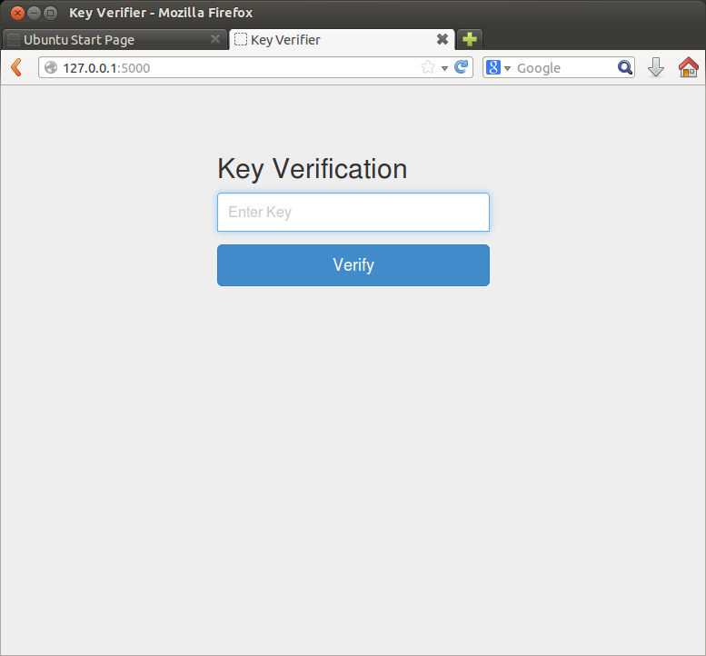

# Scoreboard

## About
A lightweight web application that allows users to submit keys and verifies the results.
The app uses CDN resources, so Internet access is required.

## Install

    git clone https://github.com/nfarrar/Scoreboard.git
    pip install flask flask-script wtforms

## Configuration

Modify the value of app.password in verify.py to whatever the key value is that should be verified.

## Usage

    python verify.py runserver -t 0.0.0.0

## Screenshot

## License

Scoreboard is released under the [GPLv3 License](LICENSE.txt).
